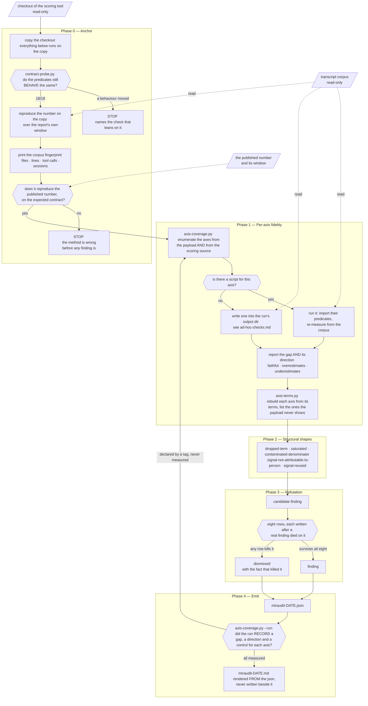

# miraudit

Audits a score that someone else's code computed about your work, and tells you whether it
reflects what you actually did.

It is built for gnomon / xl-ai-insights AQ reports, but the checks are written as shapes of
infidelity rather than as a list of that tool's known bugs, so they survive the formula
changing. It does not compute a score, propose formula changes, or rank anyone.

A run produces two files: `miraudit-<date>.json` and a human-readable
`miraudit-<date>.md` rendered from it. The JSON is what makes runs comparable. One person's
corpus is an anecdote; the same gap measured on five machines is a defect in the axis.

## How a run flows

The diamonds are decision points. Three of them stop the run rather than annotate it: the
behaviour probe and the reproduction check in Phase 0, and the refutation gate in Phase 3.
A fourth, the coverage check in Phase 4, sends the run backwards instead of forwards.
Everything the audited tool owns is read-only: its checkout is copied before anything
imports from it, and the transcripts are never written to at all.

The line breaks below are written as ` <br/> ` with spaces around them on purpose. Renderers
that disable HTML labels drop the tag instead of honouring it, and without the spaces every
label in this diagram closed up into words like `scoring toolread-only`.



An empty `findings` list with a populated `dismissed` list is a normal, useful result: it
says the run worked and that what it looked at went through a filter.

`references/example-run/miraudit-2026-08-10.json` is one, in full: a real run against
`c6401cc`, two private file paths redacted and nothing else touched. Its `process_friction`
is the part worth reading — that is where a run records what the audit cost that the audited
tool did not cause, and this one records that the anchor had been importing the scoring tool
from the working directory, so every previous run had measured the original checkout instead
of the copy and reported the right number by coincidence.

## What it checks

**Anchor.** Reproduces the published number locally before measuring anything. If the base
run does not reproduce it, the method is wrong before any finding is, and the run stops.
Prints a corpus fingerprint first, because counts compared across machines mean nothing
without one.

It also probes the audited tool's predicates for *behaviour* before spending minutes on the
pipeline. Checking that a symbol still exists is easy and catches the cheap failure; the
expensive one is a definition that tightens while the name stays, after which every check
keeps running and quietly stops meaning what its labels say. That happened here: a section
reported scratchpad contamination for a long time after the tool began excluding scratchpad
writes itself, and it was found by reading a diff, not by any run. `contract-probe.py`
asserts eighteen behaviours and names the check that leans on each one. Every assertion was
verified by breaking it: neutralize a predicate in a throwaway copy and exactly the lines
that depend on it go red, no others.

**Per-axis fidelity.** Takes each axis's declared signals, re-measures the underlying
behaviour from the transcript corpus, and reports the gap and its direction: faithful,
overestimates, or underestimates. Ground truth never comes from the tool's own aggregates.

Most axes have no script, so the first thing a run does is find out which.
`scripts/axis-coverage.py` derives the axis list from two places — the anchored payload, for
what was scored, and the scoring source, for what exists — reports which axes a check claims
and which the run is about to skip, and exits non-zero while any is unaccounted for. Their
difference is itself a finding: an axis present in the source and absent from the payload is
a dropped term, which until now was caught only by reading code by eye. It found two on its
first run, one of each kind.

That list used to be maintained by hand in prose, and it had been missing an axis for as
long as it existed. Nobody noticed, because nothing enumerated the axes to check the prose
against: the same failure, one level up, as the ones this skill reports. The count is no
longer written down anywhere either. The correction that fixed the missing axis replaced a
wrong hand-typed number with a right one, and the right one was stale the next day.

**A tag is not a measurement**, which is what `--run` separates. On its own the manifest
greps `# miraudit-covers:` out of source comments, and a comment says a script claims an
axis. It does not say the script ran, that it exited 0, or that anyone recorded a gap and a
direction. Given the run's own JSON, `axis-coverage.py --run` splits the axes into measured,
declared without a recorded measurement, and uncovered, and fails while anything sits outside
the first. Reported the weaker way, a run once verdicted "11 of 11" while its own artifact
held six, with two axes appearing in no run's records at all.

**Terms, not only axes.** An axis can be covered while a term inside it is invisible, which
is where the one hard finding of this audit lived: 30% of Skill fluency is a substring match
on five skill names that appears in no signal. `scripts/axis-terms.py` generalises that
recovery. It parses each axis's terms from the scoring source, evaluates the ones the payload
publishes, and solves for a single remaining unknown by algebra on the tool's own
`normalized_score`. The anchor is that rebuild: a parse that loses a term disagrees with the
published score and the axis is reported as not decomposable, so an incomplete parse can
never report a smaller world as a complete one.

Two of its guards exist because it was wrong first. A recovered value is checked against the
payload before it is called undisclosed, since Verification's coverage term is published as
`test_coverage` under a name its expression never uses. And the check runs against the whole
payload rather than one axis's signals, because Discipline's term is rebuildable from two
fields under `/behavior` and an importable constant. Both had been proposed as findings.

**Structural shapes**, independent of any formula: terms silently renormalized away for
lack of evidence, saturated axes that no longer discriminate, denominators containing work
the person did not do, counters driven by the harness rather than by anyone's judgement,
and one counter feeding two pillars.

`scripts/saturation-counterfactual.py` covers the second of those. It cuts every saturated
signal down to exactly the threshold the tool still awards full marks for, re-scores with
the tool's own function, and reports what the total does. Controls at a fraction of each
threshold must move, or the headline is a broken fixture rather than a finding. It also
prints which signals it looked for and could not find, because a silently skipped signal
makes the result look better covered than it is.

Where a threshold is a named constant it is imported. Where it is an inline literal there is
nothing to import, and restating it would be the very mistake this skill reports, so the
saturation point is **discovered by bisection** instead: lower the signal until the axis
scores move, using the tool's own scoring function as the oracle. The run validates that
method before trusting it, by bisecting a threshold it could have imported and checking the
two agree.

**A refutation gate.** Nothing is reported until it survives eight attempts to kill it. Each
attempt exists because it killed a real finding that was about to be sent; the write-ups
are in `references/refutation.md`. Findings that die are recorded in `dismissed` with the
fact that killed them, so nobody reopens them. The gate is deterministic on purpose, and
`references/design-rationale.md` explains why it is not a panel of reviewers.

## Install

**Copy the directory.** Verified.

```bash
git clone <repo> /tmp/miraudit-src
cp -r /tmp/miraudit-src/miraudit ~/.claude/skills/    # all your projects
# or
cp -r /tmp/miraudit-src/miraudit .claude/skills/      # this project only
```

**Via the skills CLI.** Verified, including that `scripts/` and `references/` come with it,
which matters because the checks are the point.

```bash
npx skills add "ftrinidad/gnomon#feat/miraudit-skill" -a claude-code -s miraudit -y
```

**The `#branch` suffix is not optional here.** This skill lives on a branch of a fork, and
the bare `owner/repo` form clones the default branch and reports "No skills found" — a
message that reads like the skill is broken rather than like you are looking at the wrong
branch. Drop the suffix once it lands on a default branch somewhere.

That installs into `.claude/skills/` for the current project. `-g` puts it in
`~/.claude/skills/` for every project instead. **If you are the one editing this skill, do
not use `-g`**: that is where the source lives, and the installer would write over it.

**As part of a plugin.** If it ships inside one, install the plugin and read the update
note below, which matters more than it looks.

### Why it is not a plugin here

The layout is already what a Claude Code plugin expects, so wrapping it needs one file:
a `.claude-plugin/plugin.json` manifest beside this `skills/` directory.

That wrapper was left out on purpose. A plugin buys marketplace distribution, versioning,
and the ability to bundle agents, hooks and commands alongside a skill. This is a skill on
its own, and a personal skill copied to `~/.claude/skills/` is already available in every
project, so the wrapper would add ceremony without adding reach. Wrapping it would also
mean turning its host repository into a plugin marketplace, which is a separate decision
for whoever owns that repository.

## Use

```
/miraudit
```

Or describe the symptom and let the agent pick it up: "my score dropped four points and I
did not change how I work."

**Give it room to run.** Phase 0 copies a checkout and reproduces the published number, and
the counterfactual checks read the whole transcript corpus. That is minutes, not seconds. A
subagent with a watchdog will kill it partway and report nothing useful, so run it in the
background or in a session that can wait.

The checks in `scripts/` also run standalone. Start with the anchor, which does Phase 0 in
one command and writes the `stats.json` the other checks read:

```bash
python3 scripts/anchor.py --checkout /path/to/gnomon --since 2026-07-07 --until 2026-08-06 \
    --published 92 --expect-contract 17:17:17
```

It copies the checkout, reproduces the published number on the copy, prints the corpus
fingerprint, and tells you where `stats.json` landed.

**Pass `--published`.** With it the anchor compares and exits non-zero when the two numbers
disagree, saying which is which. Without it the script prints the number and asks you to
compare it yourself, which is what it used to do, and a gate nobody is forced through is not
a gate. A number that did not reproduce makes every later finding unsafe to read, so this is
the one place worth failing loudly.

`--expect-contract` **now defaults from the pin**, so the contract half is gated whether or
not you remember the flag. The value lives once, in a ```pin block at the top of
`references/known-state.md`, and `scripts/pin-consistency.py` — which the anchor runs beside
the behaviour probe — checks that block against the prose beside it, against the pasteable
command below, and against `SCORE_CONTRACT_ID` imported from the checkout. It had been
stated in three places with nothing comparing them, and the refresh procedure named two of
the three; the third was this README, where a stale value is executable-wrong rather than
merely out of date. It also says, without failing the run, when upstream has moved past the
pin.

Then the individual checks. **Point them at the copy the anchor made, not at the original.**
They import the tool's own predicates, and importing writes `__pycache__` directories into
the package — so aiming a check at the real checkout modifies the thing being audited. The
anchor prints the copy's path for this reason.

```bash
COPY=/path/printed/by/anchor/checkout
STATS=/path/printed/by/anchor/stats.json
W="--since 2026-07-07 --until 2026-08-06 --stats $STATS"

python3 scripts/fidelity-audit.py       --checkout "$COPY" $W
python3 scripts/verification-reality.py --checkout "$COPY" $W --repo /your/repo --ref main
```

Every check takes the same window and stats arguments, including the ones that ignore them,
so you never have to remember which script accepts what. Passing `--since` and `--days`
together is an error when they disagree rather than a silent choice between them.

`--until` is the report's own end date. Leave it out and the window ends now, which drifts
every day and includes the audit session itself, so the checks describe different days than
the report does.

`--stats` points at the anchored run's `stats.json`. Axis scores are read from there and
never baked into the scripts, so a header cannot go stale when an axis moves.

They import the scoring tool's own predicates on purpose. A denominator you define yourself
produces a number that is true and means nothing. That mistake is documented in
`references/refutation.md`.

### Running it on a second corpus

The `saturated` shape is the one finding a single corpus cannot settle: it cannot tell "the
axis saturates" from "this person clears every bar."

**The entire ask is one command**, and it installs nothing:

```bash
uvx --from "git+https://github.com/ftrinidad/gnomon@feat/miraudit-skill#subdirectory=skills/miraudit" \
    miraudit-second-corpus
```

It needs `python3`, `git` and `uv`, and **no shell** — PowerShell and CMD are fine. This
paragraph used to say a POSIX shell was required and to send Windows runners to Git Bash.
Every published requirements list already said "python3, git and uv" while the whole path
went through `bash`, and on Windows a bare `bash` is the WSL launcher, which fails inside
WSL complaining about a missing `/bin/bash`. That is what the first Windows runner got. Git
Bash would have worked and was still the wrong fix: the orchestration moved into Python
instead, so `scripts/anchor.sh` and `scripts/second-corpus.sh` are one-line shims that exec
their `.py` twin, and there is one implementation rather than two.

It takes about two minutes and 16 MB of scratch that is deleted afterwards, uploads nothing,
and writes one small JSON into the directory you ran it from. If that directory is not
writable it says so at the start and falls back to your home directory, because a Windows
runner once completed the whole run from a terminal that starts inside `C:\Program Files`
and lost it to a `PermissionError` on the last line. Nothing was wrong with that
measurement; it had nowhere to land and found out last.

Send the file back. It carries counts and shares — no transcripts, no file contents, no
paths, no repository names — and it is short enough to read before sending, which is the
point: a person contributing data about their own work should see what leaves their machine.

`references/second-corpus.md` is the handout — prerequisites, what comes back, what is
deliberately not compared, and the decision rules written down **before** the second run,
including the ones that withdraw a finding.

## Updating

**If you installed it as a plugin, editing the source does not change what runs.** Plugins
execute from a version-pinned snapshot under
`~/.claude/plugins/cache/<org>/<plugin>/<version>/`, which is a copy, not a symlink. Diff
the file you edited against the cached one before you trust any test of your change. This
has burned real money more than once.

**Knowing when the skill has gone stale.** `references/known-state.md` pins the commit and
contract string it was validated against, in a ```pin block that code reads: `--expect-contract`
defaults from it, so the anchor stops the run on a moved contract whether or not you remember
the flag. When it does stop, the fixtures in `scripts/` have to be re-run before anyone quotes
a finding, because a check written against one contract and silently measuring another is
worse than no check.

**A moved commit is not a moved contract.** `pin-consistency.py` says when upstream has moved
past the pin, as a note rather than a failure, and it moved twice in one afternoon while this
paragraph was being written — which is why the count is not written here. Reading the diff is
the cheap half of the answer: a commit that leaves `scoring/`, `taxonomy.py` and the
accumulator alone cannot move the contract. The half worth doing is running both refs against
the same corpus in the same window. That has come back identical so far, AQ and every axis.
Two axes did appear to move the first time, against a payload from earlier the same day, and
that was the corpus growing underneath a fixed window rather than the code.

## Scope

It reads the transcript corpus and a checkout of the scoring tool. It writes only inside its
own output directory, and never inside the audited repository. When code has to be modified
to prove something, it patches a throwaway copy.

It cannot see what it has no record of. Tests that run inside a git hook, checks that run in
CI, and commands you typed in your own terminal are all invisible to the corpus, so they are
invisible here too. It reports what the transcripts show and says which questions it did not
ask.

An empty findings list means the run worked and found nothing to report.
