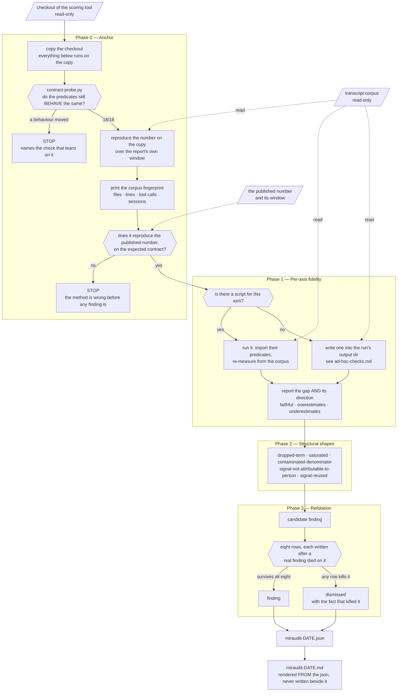

# miraudit

Audits a score that someone else's code computed about your work, and tells you whether it
reflects what you actually did.

It is built for gnomon / xl-ai-insights AQ reports, but the checks are written as shapes of
infidelity rather than as a list of that tool's known bugs, so they survive the formula
changing. It does not compute a score, propose formula changes, or rank anyone.

A run produces two files: `miraudit-<date>.json` and a human-readable
`miraudit-<date>.md` rendered from it. The JSON is what makes runs comparable. One person's
corpus is an anecdote; the same gap measured on five machines is a defect in the axis.

## How a run flows

Two phases are gates that stop the run rather than annotate it, and they are drawn as
diamonds. Everything the audited tool owns is read-only: its checkout is copied before
anything imports from it, and the transcripts are never written to at all.



An empty `findings` list with a populated `dismissed` list is a normal, useful result: it
says the run worked and that what it looked at went through a filter.

`references/example-run/miraudit-2026-08-10.json` is one, in full: a real run against
`c6401cc`, two private file paths redacted and nothing else touched. Its `process_friction`
is the part worth reading — that is where a run records what the audit cost that the audited
tool did not cause, and this one records that the anchor had been importing the scoring tool
from the working directory, so every previous run had measured the original checkout instead
of the copy and reported the right number by coincidence.

## What it checks

**Anchor.** Reproduces the published number locally before measuring anything. If the base
run does not reproduce it, the method is wrong before any finding is, and the run stops.
Prints a corpus fingerprint first, because counts compared across machines mean nothing
without one.

It also probes the audited tool's predicates for *behaviour* before spending minutes on the
pipeline. Checking that a symbol still exists is easy and catches the cheap failure; the
expensive one is a definition that tightens while the name stays, after which every check
keeps running and quietly stops meaning what its labels say. That happened here: a section
reported scratchpad contamination for a long time after the tool began excluding scratchpad
writes itself, and it was found by reading a diff, not by any run. `contract-probe.py`
asserts eighteen behaviours and names the check that leans on each one. Every assertion was
verified by breaking it: neutralize a predicate in a throwaway copy and exactly the lines
that depend on it go red, no others.

**Per-axis fidelity.** Takes each axis's declared signals, re-measures the underlying
behaviour from the transcript corpus, and reports the gap and its direction: faithful,
overestimates, or underestimates. Ground truth never comes from the tool's own aggregates.

**Structural shapes**, independent of any formula: terms silently renormalized away for
lack of evidence, saturated axes that no longer discriminate, denominators containing work
the person did not do, counters driven by the harness rather than by anyone's judgement,
and one counter feeding two pillars.

`scripts/saturation-counterfactual.py` covers the second of those. It cuts every saturated
signal down to exactly the threshold the tool still awards full marks for, re-scores with
the tool's own function, and reports what the total does. Controls at a fraction of each
threshold must move, or the headline is a broken fixture rather than a finding. It also
prints which signals it looked for and could not find, because a silently skipped signal
makes the result look better covered than it is.

Where a threshold is a named constant it is imported. Where it is an inline literal there is
nothing to import, and restating it would be the very mistake this skill reports, so the
saturation point is **discovered by bisection** instead: lower the signal until the axis
scores move, using the tool's own scoring function as the oracle. The run validates that
method before trusting it, by bisecting a threshold it could have imported and checking the
two agree.

**A refutation gate.** Nothing is reported until it survives seven attempts to kill it. Each
attempt exists because it killed a real finding that was about to be sent; the write-ups
are in `references/refutation.md`. Findings that die are recorded in `dismissed` with the
fact that killed them, so nobody reopens them. The gate is deterministic on purpose, and
`references/design-rationale.md` explains why it is not a panel of reviewers.

## Install

**Copy the directory.** Verified.

```bash
git clone <repo> /tmp/miraudit-src
cp -r /tmp/miraudit-src/miraudit ~/.claude/skills/    # all your projects
# or
cp -r /tmp/miraudit-src/miraudit .claude/skills/      # this project only
```

**Via the skills CLI.** Not verified yet. Confirm how it discovers skills in a repository
before relying on it.

```bash
npx skills add OWNER/REPO -a claude-code
```

**As part of a plugin.** If it ships inside one, install the plugin and read the update
note below, which matters more than it looks.

### Why it is not a plugin here

The layout is already what a Claude Code plugin expects, so wrapping it needs one file:
a `.claude-plugin/plugin.json` manifest beside this `skills/` directory.

That wrapper was left out on purpose. A plugin buys marketplace distribution, versioning,
and the ability to bundle agents, hooks and commands alongside a skill. This is a skill on
its own, and a personal skill copied to `~/.claude/skills/` is already available in every
project, so the wrapper would add ceremony without adding reach. Wrapping it would also
mean turning its host repository into a plugin marketplace, which is a separate decision
for whoever owns that repository.

## Use

```
/miraudit
```

Or describe the symptom and let the agent pick it up: "my score dropped four points and I
did not change how I work."

**Give it room to run.** Phase 0 copies a checkout and reproduces the published number, and
the counterfactual checks read the whole transcript corpus. That is minutes, not seconds. A
subagent with a watchdog will kill it partway and report nothing useful, so run it in the
background or in a session that can wait.

The checks in `scripts/` also run standalone. Start with the anchor, which does Phase 0 in
one command and writes the `stats.json` the other checks read:

```bash
scripts/anchor.sh --checkout /path/to/gnomon --since 2026-07-07 --until 2026-08-06 \
    --published 92 --expect-contract 17:17:17
```

It copies the checkout, reproduces the published number on the copy, prints the corpus
fingerprint, and tells you where `stats.json` landed.

**Pass `--published`.** With it the anchor compares and exits non-zero when the two numbers
disagree, saying which is which. Without it the script prints the number and asks you to
compare it yourself, which is what it used to do, and a gate nobody is forced through is not
a gate. `--expect-contract` does the same for the contract string in
`references/known-state.md`. A number that did not reproduce makes every later finding
unsafe to read, so this is the one place worth failing loudly.

Then the individual checks. **Point them at the copy the anchor made, not at the original.**
They import the tool's own predicates, and importing writes `__pycache__` directories into
the package — so aiming a check at the real checkout modifies the thing being audited. The
anchor prints the copy's path for this reason.

```bash
COPY=/path/printed/by/anchor/checkout
STATS=/path/printed/by/anchor/stats.json
W="--since 2026-07-07 --until 2026-08-06 --stats $STATS"

python3 scripts/fidelity-audit.py       --checkout "$COPY" $W
python3 scripts/verification-reality.py --checkout "$COPY" $W --repo /your/repo --ref main
```

Every check takes the same window and stats arguments, including the ones that ignore them,
so you never have to remember which script accepts what. Passing `--since` and `--days`
together is an error when they disagree rather than a silent choice between them.

`--until` is the report's own end date. Leave it out and the window ends now, which drifts
every day and includes the audit session itself, so the checks describe different days than
the report does.

`--stats` points at the anchored run's `stats.json`. Axis scores are read from there and
never baked into the scripts, so a header cannot go stale when an axis moves.

They import the scoring tool's own predicates on purpose. A denominator you define yourself
produces a number that is true and means nothing. That mistake is documented in
`references/refutation.md`.

### Running it on a second corpus

The `saturated` shape is the one finding a single corpus cannot settle: it cannot tell "the
axis saturates" from "this person clears every bar." `references/second-corpus.md` is the
handout for whoever runs it next — prerequisites, what comes back, what is deliberately not
compared, and the decision rule written down **before** the second run, including the result
that withdraws the finding.

## Updating

**If you installed it as a plugin, editing the source does not change what runs.** Plugins
execute from a version-pinned snapshot under
`~/.claude/plugins/cache/<org>/<plugin>/<version>/`, which is a copy, not a symlink. Diff
the file you edited against the cached one before you trust any test of your change. This
has burned real money more than once.

**Knowing when the skill has gone stale.** `references/known-state.md` pins the commit and
contract string it was validated against. Pass that string as `--expect-contract` and the
anchor stops the run when the checkout has moved. When it does, the fixtures in `scripts/`
have to be re-run before anyone quotes a finding: a check written against one contract and
silently measuring another is worse than no check. Nothing reads `known-state.md` for you,
so an operator who omits the flag gets no comparison — this paragraph used to claim
otherwise.

## Scope

It reads the transcript corpus and a checkout of the scoring tool. It writes only inside its
own output directory, and never inside the audited repository. When code has to be modified
to prove something, it patches a throwaway copy.

It cannot see what it has no record of. Tests that run inside a git hook, checks that run in
CI, and commands you typed in your own terminal are all invisible to the corpus, so they are
invisible here too. It reports what the transcripts show and says which questions it did not
ask.

An empty findings list means the run worked and found nothing to report.
